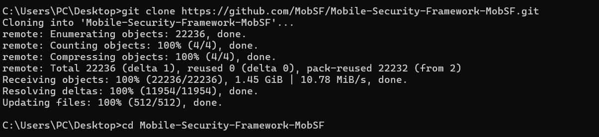
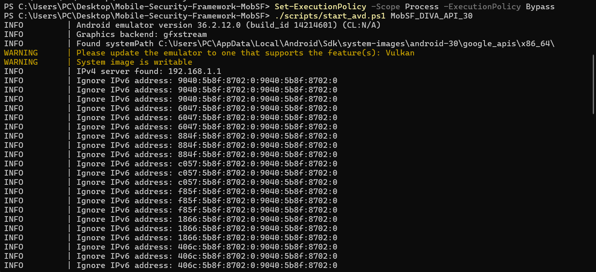
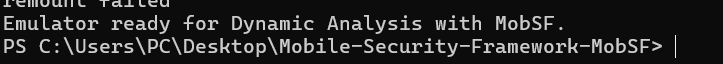
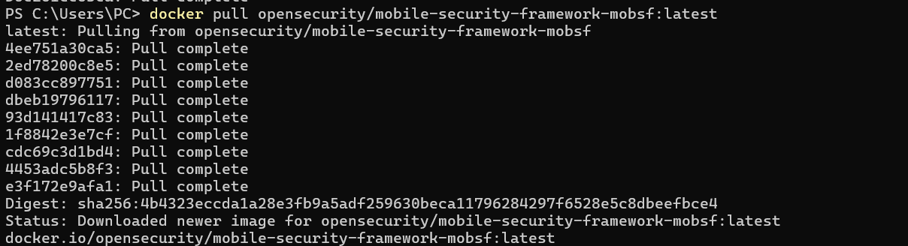
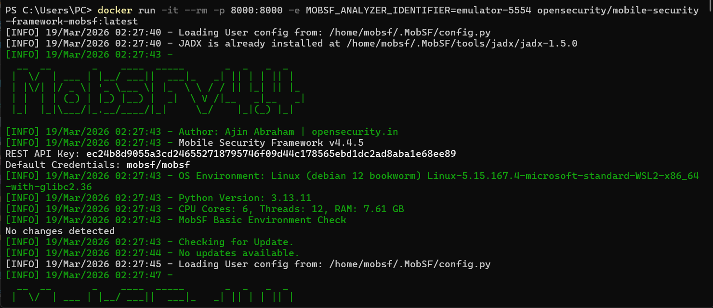
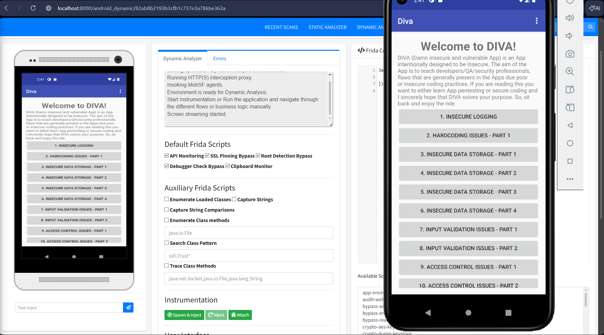
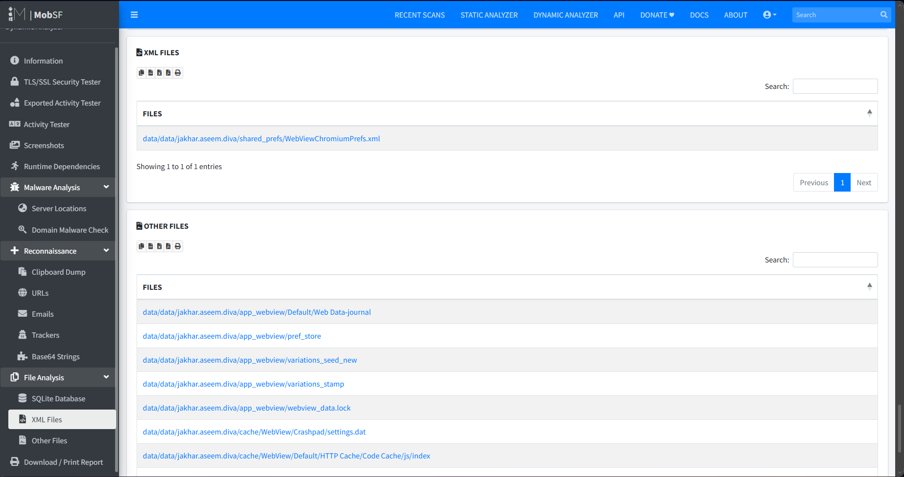

# Analyse Dynamique Android – MobSF avec Docker (Application DIVA)

## Introduction

Ce laboratoire a pour objectif de mettre en place un environnement d'analyse de sécurité mobile automatisé en utilisant MobSF (Mobile Security Framework).  

À travers l'utilisation de Docker et d'un émulateur Android (AVD), nous analysons dynamiquement l'application DIVA (Damn Insecure and Vulnerable App) afin d’identifier des vulnérabilités liées au stockage, des fuites de données et de tester des mécanismes d'instrumentation via Frida.

---

## Outils utilisés

Les outils suivants sont nécessaires pour réaliser ce laboratoire :

- Git – gestion de version et récupération des scripts  
- PowerShell – exécution des scripts de configuration de l'émulateur  
- Android SDK / AVD – émulation de l'appareil cible  
- Docker – déploiement isolé du framework MobSF  
- MobSF – framework d'analyse statique et dynamique  

---

## Installation et préparation de l’environnement

### 1. Clonage du projet

Nous commençons par cloner le dépôt officiel de MobSF afin d’accéder aux scripts nécessaires à la communication entre l’hôte et l’émulateur :

---

### 2. Lancement de l’émulateur Android

Pour permettre une analyse dynamique efficace, nous utilisons un script PowerShell pour démarrer l’émulateur avec les privilèges appropriés et un système de fichiers accessible :

---

## Déploiement de MobSF via Docker

### 3. Récupération de l’image

Nous utilisons Docker pour télécharger la dernière version de MobSF :

---

### 4. Lancement de l’analyseur

Le conteneur MobSF est lancé en spécifiant l’identifiant de l’émulateur :

docker run -it --rm -p 8000:8000 -e MOBSF_ANALYZER_IDENTIFIER=emulator-5554 opensecurity/mobile-security-framework-mobsf:latest

MobSF détecte automatiquement l’émulateur sur le port 5554.

L’interface web est accessible via :

http://localhost:8000

---

## Exploitation et analyse dynamique

### 5. Interface de test (Application DIVA)

Une fois connecté à l’interface web, nous lançons l’analyse dynamique.

L’écran de l’émulateur est affiché dans le navigateur, ce qui permet :

- D’interagir avec les fonctionnalités vulnérables de DIVA  
- D’observer le comportement de l’application en temps réel  
- D’activer des scripts Frida pour contourner certaines protections  

Exemples de bypass possibles :

- SSL Pinning  
- Root Detection  
- Debugger Detection

Et on peut simplement parcourire tout les resultats de nos test et telecharger un rapport pdf d'ici : 

---

## Conclusion

Ce laboratoire nous a permis de maîtriser le cycle complet d’une analyse dynamique mobile moderne.

L’utilisation de MobSF couplée à Docker simplifie considérablement la mise en place de l’environnement et permet une exploitation rapide des vulnérabilités courantes.

